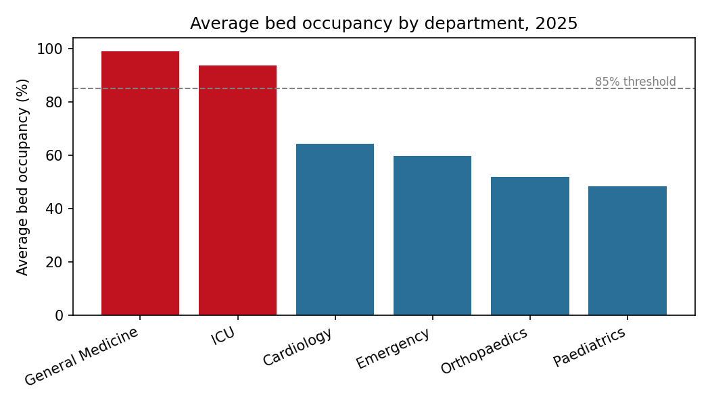
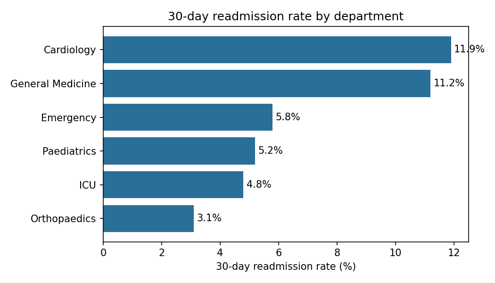

# Hospital Operations Analytics (SQL + Python)

An end-to-end analysis of hospital capacity and patient flow: a relational SQLite
database is queried with SQL, then summarised and visualised in Python (pandas, matplotlib).

> **Data note:** all data is **synthetically generated** (fixed random seed) for learning
> purposes. No real patient data is used, and findings describe the simulated hospital only.

## Business questions

| # | Question | SQL technique |
|---|----------|---------------|
| 1 | How long do patients stay in each department? | JOIN, GROUP BY, AVG |
| 2 | Which departments are near or over bed capacity? | Recursive CTE, CROSS JOIN, CASE |
| 3 | At what hour do admissions arrive? | strftime, GROUP BY |
| 4 | Is there a seasonal pattern? | Date aggregation |
| 5 | What share of patients return within 30 days? | Correlated subquery (EXISTS), CTE |
| 6 | How is workload spread across doctors? | Window function (RANK) |

## Database schema

`departments` (dept_id, name, bed_capacity) ·
`doctors` (doctor_id, name, dept_id) ·
`patients` (patient_id, age, gender) ·
`admissions` (admission_id, patient_id, dept_id, doctor_id, admit_ts, discharge_ts, diagnosis_group)

## Project structure

```
data/        SQLite database (generated)
sql/         one .sql file per business question
src/
  create_db.py   builds the synthetic database
  analysis.py    runs the SQL files, saves CSV tables and charts
outputs/     charts (PNG), result tables (CSV), findings.txt
```

## How to run

```bash
pip install -r requirements.txt
python src/create_db.py     # creates data/hospital.db
python src/analysis.py      # writes charts and tables to outputs/
```

## Key findings (simulated 2025 data)

- **Bed pressure is concentrated in two departments.** General Medicine averages ~99%
  occupancy and sits at 90%+ of capacity on about two thirds of days; ICU averages ~94%.
  Other departments run at 48-64%.
- **Admissions are seasonal.** Winter months (Jun-Aug) run roughly 20-35% above the rest of
  the year, driven by Emergency, General Medicine, Paediatrics and ICU.
- **Arrivals peak mid-morning** (around 09:00), which matters for rostering.
- **Cardiology and General Medicine have the highest 30-day readmission rates** (~11-12%),
  about double most other departments.




## Limitations

- Synthetic data: patterns (winter peak, high General Medicine load) were built into the
  generator, so this project demonstrates the *method*, not real-world discoveries.
- Occupancy is counted per calendar day, not per hour, and ignores transfers between wards.
- Readmission is defined as a return to the same department within 30 days.

## Possible next steps

- Replace the generator with a real, de-identified public dataset.
- Forecast monthly admissions (e.g. seasonal naive / simple regression).
- Add a staffing-demand estimate from the hourly arrival profile.
